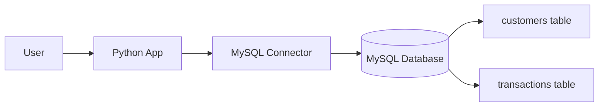

# Bank Management System (Python + MySQL)

<p align="center">
  
  
  
</p>

A bank data management project built using Python and MySQL. It allows efficient management of core banking operations such as customer account creation, deposits, withdrawals, balance inquiry, and transaction record tracking.

## Overview

This project is a simple but practical banking system that combines Python application logic with a MySQL database backend. Python handles the user interaction and core business logic, while MySQL stores and manages persistent account information and transaction history securely.

The system is designed for educational use, prototype development, and database-driven application learning.

## System Architecture



## Key Features

- Customer account creation
- Deposit processing
- Withdrawal handling
- Balance inquiry
- Transaction record tracking
- Persistent data storage with MySQL
- Error handling and input validation

## Implementation Details

- Python handles the application logic and CLI/GUI operations.
- MySQL stores and manages persistent bank data.
- SQL queries are executed through Python's MySQL connector to perform CRUD operations on customer and transaction tables.
- The project can be extended with authentication, admin access, and reporting features.

## Database Tables

### customers

| Field | Type | Description |
| --- | --- | --- |
| id | INT | Unique customer ID |
| name | VARCHAR | Customer name |
| email | VARCHAR | Customer email address |
| phone | VARCHAR | Customer mobile number |
| balance | DECIMAL | Current account balance |

### transactions

| Field | Type | Description |
| --- | --- | --- |
| id | INT | Transaction ID |
| customer_id | INT | Related customer |
| type | VARCHAR | Deposit or withdrawal |
| amount | DECIMAL | Transaction amount |
| date | DATE | Date of the transaction |
| time | TIME | Time of the transaction |

## Security & Reliability

- Proper authentication and access control can be added for secure use.
- Input validation helps prevent invalid or malicious values.
- Error-handling mechanisms are essential for reliable execution and data integrity.
- MySQL provides persistent storage and structured data management.

## Repository Structure

```text
bank-management-system/
├── README.md
├── LICENSE
├── project.py
├── requirements.txt
├── src/
│   └── README.md
├── docs/
│   └── README.md
└── .gitignore
```

## Getting Started

### Prerequisites

- Python 3.x
- MySQL Server
- MySQL connector library

### Install dependencies

```bash
pip install -r requirements.txt
```

### Run the project

```bash
python project.py
```

## MySQL Setup

Before running the project:

1. Create a MySQL database.
2. Create the required tables for customers and transactions.
3. Update the database credentials in the project file.
4. Ensure the connection parameters match your local MySQL setup.

## Notes

This project uses Python interfacing with MySQL and requires manual configuration of the database tables and credentials. It is designed as a learning project and can be extended into a more complete banking application with login features, reports, and admin dashboards.

## License

This project is licensed under the MIT License. See the `LICENSE` file for details.

---

<p align="center">
  <strong>Built for banking data management, Python + MySQL learning, and database-driven application practice.</strong>
</p>
