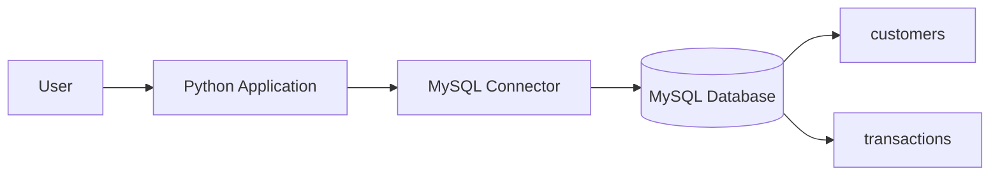

# Bank Management System (Python + MySQL)

<p align="center">
  
  
  
</p>

A bank data management system developed using Python and MySQL. The project focuses on core banking operations such as customer account creation, deposits, withdrawals, balance checking, and transaction tracking.

## Overview

This project is a simple but practical banking application that combines Python application logic with a relational database backend. Python manages the business logic and user interactions, while MySQL stores customer and transaction data securely.

The system is suitable for learning database-driven application development, CRUD operations, and basic financial workflow design.

## System Architecture



## Key Features

- Customer account creation
- Deposit operations
- Withdrawal operations
- Balance inquiry
- Transaction history tracking
- Persistent data storage with MySQL
- Basic validation and error handling

## Implementation Details

- Python handles the application logic for user operations.
- MySQL stores persistent banking data.
- SQL queries are executed through the Python MySQL connector to perform CRUD operations.
- This project can be expanded with authentication, admin panels, statement generation, and reporting features.

## Database Tables

### customers

| Field | Type | Description |
| --- | --- | --- |
| id | INT | Unique customer ID |
| name | VARCHAR | Customer name |
| email | VARCHAR | Customer email address |
| phone | VARCHAR | Contact number |
| balance | DECIMAL | Current account balance |

### transactions

| Field | Type | Description |
| --- | --- | --- |
| id | INT | Transaction ID |
| customer_id | INT | Related customer |
| type | VARCHAR | Deposit or withdrawal |
| amount | DECIMAL | Transaction amount |
| date | DATE | Transaction date |
| time | TIME | Transaction time |

## Security & Reliability

- Input validation helps prevent invalid data entry.
- Error-handling mechanisms improve reliability during execution.
- MySQL ensures structured and persistent storage.
- Additional security features such as login authentication and role-based access can be added in future improvements.

## Repository Structure

```text
bank-management-system/
├── README.md
├── LICENSE
├── project.py
├── requirements.txt
├── src/
│   └── README.md
├── docs/
│   └── README.md
└── .gitignore
```

## Getting Started

### Prerequisites

- Python 3.x
- MySQL Server
- MySQL connector for Python

### Install dependencies

```bash
pip install -r requirements.txt
```

### Run the application

```bash
python project.py
```

## MySQL Setup

Before running the project:

1. Create a MySQL database.
2. Create the required `customers` and `transactions` tables.
3. Update the database credentials inside the Python project file.
4. Make sure the connection settings match your MySQL server configuration.

## Notes

This project uses Python to interface with MySQL, and the database tables need to be created manually before use. It is intended as a practical learning project and can be extended into a more complete banking system.

## License

This project is licensed under the MIT License. See the `LICENSE` file for details.

---

<p align="center">
  <strong>Built for banking data management, database learning, and Python + MySQL application development.</strong>
</p>
